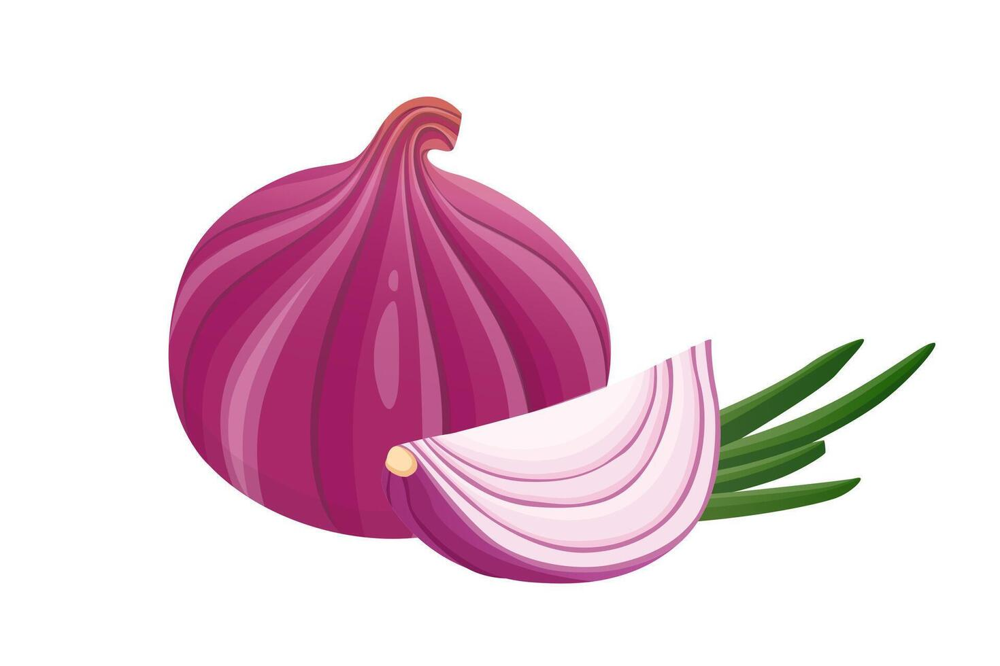

#  OnionGuard

**AI-Powered Onion Disease Detection for Farmers in Ghana**

> Currently in **Closed Testing** on Google Play Store

---

## Problem Statement

Crop losses due to pests and diseases remain a major threat to food security in West Africa, with losses reaching up to **50%** in some regions ([Appiah et al., 2025](https://doi.org/10.1016/j.dib.2025.111357)). While AI-based disease detection has shown promise, most existing models and datasets focus on crops like tomatoes and maize, with **no pre-existing ML models** available for onion disease classification. The **TOM2024 dataset** — a comprehensive collection of 25,844 field-captured images across tomato, onion, and maize crops — was published in 2025, but provides only raw and augmented data without trained models. OnionGuard addresses this gap by training a custom classification model on TOM2024's onion subset and deploying it in a mobile application accessible to farmers who need it most.

---

## Overview

OnionGuard is a mobile application that uses machine learning to help onion farmers detect crop diseases early, check onion freshness, and receive treatment recommendations in local languages.

---

## ML Model & Training

### Dataset: TOM2024

The model was trained on the **onion subset** of the [TOM2024 dataset](https://data.mendeley.com/datasets/3d4yg89rtr/1) (Appiah et al., Data in Brief, 2025), which contains high-resolution field images captured across multiple regions in Burkina Faso under diverse environmental conditions. The onion subset consists of **3,044 images** across 6 classes:

| Class | Type | Images |
|-------|------|--------|
| Caterpillar | Pest | 879 |
| Fusarium | Disease | 738 |
| Healthy | Healthy | 679 |
| Alternaria | Disease | 515 |
| Virosis | Disease | 203 |
| Bulb Blight | Disease | 30 |

### Model Architecture

| Property | Value |
|----------|-------|
| **Base Model** | MobileNetV3-Large (ImageNet pretrained) |
| **Input** | 224 x 224 x 3 (RGB, normalized to [-1, 1]) |
| **Output** | 6 classes with confidence scores |
| **Optimizer** | AdamW (weight_decay=0.01) |
| **LR Schedule** | Cosine annealing with linear warmup |
| **Augmentation** | CutMix, Mixup, RandomFlip, Rotation, Zoom, Brightness, Contrast |
| **Regularization** | Dropout(0.3), Label Smoothing, Class Weights for imbalance |
| **Quantization** | Float16 post-training quantization |

### Training Strategy

The model uses a **3-stage progressive fine-tuning** approach:

| Phase | Strategy | Epochs | Learning Rate |
|-------|----------|--------|---------------|
| **Phase 1** | Train classifier head only (backbone frozen) | 20 | 1e-3 |
| **Phase 2** | Unfreeze last 30% of backbone | 25 | 1e-4 |
| **Phase 3** | Full fine-tuning (all layers trainable) | 15 | 1e-5 |

### Results

| Metric | Value |
|--------|-------|
| **Full Model Test Accuracy** | 100.00% |
| **TFLite INT8 Accuracy** | 94.23% |
| **TFLite Model Size** | 5.99 MB |
| **Inference** | On-device (mobile) + server-side (backend) |

> The model achieves perfect accuracy on the held-out test set. TFLite quantization reduces model size for mobile deployment with minimal accuracy loss. Class weights are used during training to handle the significant class imbalance (879 Caterpillar vs 30 Bulb Blight images).

### Key Innovation

No pre-trained ML models existed for onion disease classification on the TOM2024 dataset prior to this work. OnionGuard is the **first application to train and deploy a production model** on this dataset, bridging the gap between published agricultural data and practical farmer-facing tools.

---

## Tech Stack

| Layer | Technology |
|-------|-----------|
| **Mobile App** |   |
| **Backend** |   |
| **Database** |  |
| **ML Model** |  |
| **AI / Vision** |  |
| **Voice** |  |
| **Infrastructure** |    |
| **SSL/DNS** |   |

---

## Features

### Disease Detection
- **On-device AI** — TFLite model (6MB) classifies 6 conditions: Alternaria, Bulb Blight, Caterpillar, Fusarium, Healthy, Virosis
- **Camera & Gallery** — Scan crops directly or pick existing photos
- **Offline capable** — ML inference runs locally, no internet required
- **Confidence scores** — View prediction breakdown for all classes

### Freshness Analysis
- **Google Gemini 2.5 Flash Vision** — AI evaluates onion freshness (Fresh / Almost Spoilt / Rotten)
- **Storage tips** — Actionable recommendations based on analysis

### Treatment Recommendations
- **Detailed guides** — Symptoms, treatment steps, prevention, local product recommendations
- **Voice playback** — Listen to treatment advice via Google TTS
- **5 languages** — English, Twi, Dagbani, Ewe, Hausa

### Analytics & Dashboards
- **Farmer** — Personal scan history, disease distribution charts
- **Extension Officer** — All farmer scans, regional trends
- **Admin** — User management, platform-wide analytics

### Security & Authentication
- **JWT authentication** with bcrypt password hashing
- **Biometric login** — Fingerprint / face recognition
- **HTTPS** — TLS 1.2/1.3 via Let's Encrypt

---

## Architecture

```
                        ┌──────────────┐
                        │  Flutter App │
                        └──────┬───────┘
                               │ HTTPS
                        ┌──────▼───────┐
                        │    Nginx     │
                        │  SSL + Proxy │
                        └──────┬───────┘
                               │
                        ┌──────▼───────┐
                        │ API Gateway  │
                        │   :8000      │
                        └──┬──┬──┬──┬──┘
                 ┌─────────┘  │  │  └─────────┐
          ┌──────▼──┐  ┌──────▼──┐  ┌──────▼──┐  ┌──────▼────┐
          │  Auth   │  │Diagnosis│  │Treatment│  │ Analytics │
          │  :8001  │  │  :8002  │  │  :8003  │  │   :8004   │
          └────┬────┘  └────┬────┘  └─────────┘  └─────┬─────┘
               │            │                          │
          ┌────▼────────────▼──────────────────────────▼────┐
          │               MongoDB Atlas                      │
          └──────────────────────────────────────────────────┘
```

---

## Backend Microservices

| Service | Port | Purpose |
|---------|------|---------|
| **API Gateway** | 8000 | Routes all requests to microservices |
| **Auth Service** | 8001 | Registration, login, JWT tokens, user management |
| **Diagnosis Service** | 8002 | TFLite inference, scan history storage |
| **Treatment Service** | 8003 | Treatment guides, voice generation (gTTS) |
| **Analytics Service** | 8004 | Scan statistics, disease trends, regional data |

---

## Deployment & Security

### AWS EC2 + Docker

All backend services are containerized with Docker and orchestrated via Docker Compose on an AWS EC2 instance (`16.16.90.16`). Each service runs in its own container with internal networking — only Nginx is exposed to the internet on ports 80 and 443.

```yaml
# Services: nginx, certbot, api-gateway, auth, diagnosis, treatment, analytics
# Backend services use "expose" (internal only) — not "ports"
# Only Nginx binds to host ports 80 and 443
```

### HTTPS with Nginx + Let's Encrypt + DuckDNS

To secure all API traffic with HTTPS:

1. **DuckDNS** — Free dynamic DNS maps `onion-guard.duckdns.org` to the EC2 public IP
2. **Nginx** — Reverse proxy handles SSL termination, redirects HTTP to HTTPS, and forwards requests to the API Gateway container
3. **Certbot** — Obtains and auto-renews Let's Encrypt SSL certificates (TLS 1.2/1.3)
4. **Certificate auto-renewal** — A Certbot container runs alongside Nginx, checking for renewal every 12 hours

```
Client → HTTPS (443) → Nginx → HTTP → API Gateway → Microservices
         ↑ TLS 1.2/1.3
         ↑ Let's Encrypt cert
```

All backend service ports (8001–8004) are internal only and not accessible from the internet.

### Flutter App

The mobile app connects exclusively over HTTPS:
```dart
static const String baseUrl = 'https://onion-guard.duckdns.org';
```

`android:usesCleartextTraffic="false"` is set in the Android manifest to block any unencrypted HTTP traffic.

---

## ML Model

| Property | Value |
|----------|-------|
| **Format** | TensorFlow Lite |
| **Size** | 5.99 MB |
| **Input** | 224 x 224 x 3 (RGB, normalized to [-1, 1]) |
| **Output** | 6 classes with confidence scores |
| **Inference** | On-device (mobile) + server-side (backend) |

**Classes:** Alternaria, Bulb Blight, Caterpillar, Fusarium, Healthy, Virosis

---

## Multi-Language Support

| Language | Code | Region |
|----------|------|--------|
| English | `en` | Default |
| Twi | `tw` | Ashanti Region |
| Dagbani | `dg` | Northern Ghana |
| Ewe | `ee` | Volta Region |
| Hausa | `ha` | West Africa |

240+ translated UI strings with voice guidance in all languages.

---

## User Roles

| Role | Capabilities |
|------|-------------|
| **Farmer** | Scan diseases, check freshness, view history & personal analytics |
| **Extension Officer** | View all farmer scans, monitor regional disease trends |
| **Admin** | Manage users (activate/deactivate), view platform-wide analytics |

---

## Project Structure

```
OnionGuard/
├── onion-guard-mobile/
│   ├── backend/
│   │   ├── api-gateway/           # FastAPI reverse proxy
│   │   ├── auth-service/          # JWT auth + user management
│   │   ├── diagnosis-service/     # TFLite ML inference
│   │   ├── treatment-service/     # Treatment guides + TTS
│   │   ├── analytics-service/     # Statistics aggregation
│   │   ├── nginx/                 # SSL + reverse proxy config
│   │   ├── docker-compose.yml     # Container orchestration
│   │   └── setup-ssl.sh           # Automated SSL setup
│   └── frontend/
│       ├── lib/
│       │   ├── pages/             # 11 screen pages
│       │   ├── services/          # API + ML + auth services
│       │   ├── providers/         # State management
│       │   ├── config/            # Theme + API endpoints
│       │   └── main.dart          # App entry point
│       └── assets/
│           └── models/            # TFLite model
├── docs/                          # GitHub Pages (account deletion)
└── README.md
```

---

## API Endpoints

**Base URL:** `https://onion-guard.duckdns.org/api/v1`

| Endpoint | Method | Description |
|----------|--------|-------------|
| `/auth/register` | POST | Create account |
| `/auth/login` | POST | Authenticate user |
| `/auth/profile/{email}` | GET | Get user profile |
| `/auth/change-password` | POST | Update password |
| `/auth/users` | GET | List all users (admin) |
| `/diagnosis/predict` | POST | Classify disease from image |
| `/diagnosis/save` | POST | Save scan result |
| `/diagnosis/history/{email}` | GET | User scan history |
| `/treatment/{disease}` | GET | Treatment guide |
| `/treatment/{disease}/voice/{lang}` | GET | Audio treatment (MP3) |
| `/analytics/log` | POST | Log scan event |
| `/analytics/summary/{email}` | GET | User statistics |
| `/analytics/summary-all` | GET | Platform statistics |
| `/analytics/regional` | GET | Regional disease data |

---

## Google Play Store

OnionGuard is currently in **closed testing** on the Google Play Store. The app targets onion farmers, where early disease detection can prevent significant crop losses and improve food security.

---

## License

This project was developed as part of academic research at the University of Ghana.

---

<p align="center">
  Built with  +  + 
</p>
